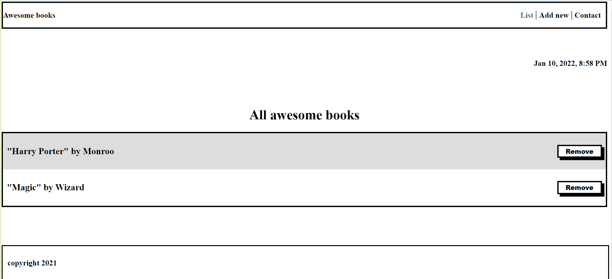

# AwesomeBooks

This is a wesbite where you can add and remove books.

## Built With

- Javascript
- HTML
- CSS

## Getting Started

To get the content of this project locally you need to run this command in your terminal:

- git clone your git@github.com:guerreiropedr0/AwesomeBooksES6.git
- cd AwesomeBooksES6
- open the index.html file to see project running.

## Live Server

In the following link, you can view [Awesome Books](https://pepedropo1.github.io/AwesomeBooksES6/)

## Authors

👤 **Matovu Farid Nkoba**

- GitHub: [@matovu-farid](https://github.com/matovu-farid)
- Twitter: [@matovu100](https://twitter.com/matovu100)
- LinkedIn: [matovu-farid](https://www.linkedin.com/in/matovu-farid-48b80257)

👤 **Josphat Nkonde**

- GitHub: [@zairdon20](https://github.com/zairdon20)
- Twitter: [@Josphat1](https://twitter.com/Josphat1/)
- LinkedIn: [zairdon](https://www.linkedin.com/in/zairdon/)

👤 **Pedro Guerreiro**

- GitHub: [@guerreiropedr0](https://github.com/guerreiropedr0)
- Twitter: [@guerreiropedr0](https://twitter.com/guerreiropedr0)
- LinkedIn: [Pedro Guerreiro](https://www.linkedin.com/in/guerreiropedr0/)

## 📝 License

This project is [MIT](./MIT.md) licensed.
